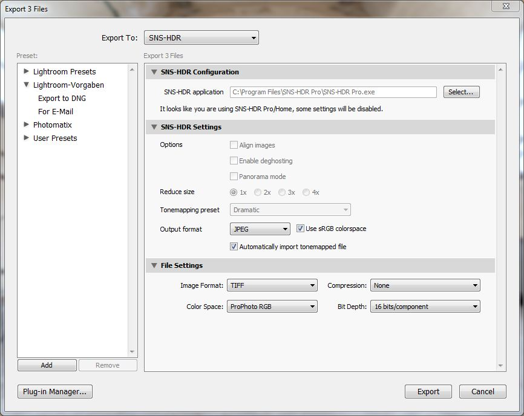

SNS-HDR Lightroom Plugin
========================

http://github.com/michaelkoetter/snshdr_lightroom

*Copyright (c) 2012 Michael Kötter.*
*All rights reserved.*
*See LICENSE for details.*

This is a Lightroom plugin to facilitate the use of SNS-HDR Lite, Pro and Home (http://www.sns-hdr.com/).
If you use SNS-HDR Pro/Home, some of the options will not be available in the plugin (because they are
available in the SNS-HDR GUI).

It has been tested with Lightroom 4 on Windows.
SNS-HDR is Windows-only, so there is no Mac version of the plugin, sorry...

Installation & Usage
====================

**Use this plugin at your own risk, this is still experimental.**
**Make sure to have a working backup of your photos before trying this plugin.**
**Don't blame me if it eats your files!**

- Get the latest release of SNS-HDR Lite, Pro or Home and install it. (http://www.sns-hdr.com/)
- Get the latest release of the plugin and unpack it (you can download a ZIP file from the github site)
- Use the Lightroom plugin manager to enable it.
- Select a set of bracketed images in the Library and open the export dialog.
- Select "SNS-HDR" as export provider at the top of the dialog
- Configure the path to your SNS-HDR executable ("SNS-HDR.exe", "SNS-HDR Pro.exe" or "SNS-HDR Home.exe")
- Configure your export settings. If you are using SNS-HDR Pro/Home, some of the settings will be grayed out -
  they are available in the SNS-HDR GUI instead.

If you are using SNS-HDR Pro/Home, just save the file at the default (temporary) location when you
are done in the GUI. It will then be moved to the folder of your source images (and optionally added to the
Lightroom library).
  

